# E-commerce System - Big Picture Overview

```mermaid
sequenceDiagram
    actor Customer
    actor Admin
    participant Storefront
    participant AdminPanel
    participant API
    participant Database
    participant PaymentService

    %% Admin Product Management Flow
    rect rgb(240, 248, 255)
        Note over Admin,Database: Admin - Product Management
        Admin->>AdminPanel: Access Product Management
        AdminPanel->>API: GET /api/admin/product.getAll
        API->>Database: Query products
        Database-->>API: Product list
        API-->>AdminPanel: Return products
        AdminPanel-->>Admin: Display product list

        Admin->>AdminPanel: Create new product
        AdminPanel->>API: POST /api/admin/product.create
        API->>Database: Insert product
        Database-->>API: Product created
        API-->>AdminPanel: Product ID
        AdminPanel-->>Admin: Success confirmation
    end

    %% Customer Shopping Flow
    rect rgb(240, 255, 240)
        Note over Customer,Database: Customer - Product Discovery & Cart
        Customer->>Storefront: Browse products (masonry grid)
        Storefront->>API: GET /api/public/product.getAll
        API->>Database: Query products
        Database-->>API: Product list
        API-->>Storefront: Return products
        Storefront-->>Customer: Display product cards

        Customer->>Storefront: Add product to cart
        Storefront->>API: POST /api/public/cart.addItem
        API->>Database: Create/Update cart & cart item
        Database-->>API: Cart updated
        API-->>Storefront: Cart upserted event
        Storefront-->>Customer: Update cart icon

        Customer->>Storefront: View cart (slide-out panel)
        Storefront->>API: GET /api/public/cart.getItems
        API->>Database: Query cart items
        Database-->>API: Cart items & total
        API-->>Storefront: Cart data
        Storefront-->>Customer: Display cart with total

        Customer->>Storefront: Update item quantity
        Storefront->>API: PUT /api/public/cart.updateItemQuantity
        API->>Database: Update cart item
        Database-->>API: Cart updated
        API-->>Storefront: Updated cart
        Storefront-->>Customer: Refresh cart display
    end

    %% Checkout & Payment Flow
    rect rgb(255, 250, 240)
        Note over Customer,PaymentService: Customer - Checkout & Payment
        Customer->>Storefront: Proceed to checkout
        Storefront->>API: POST /api/public/order.createFromCart
        API->>Database: Create order (status: new, payment: unpaid)
        API->>Database: Create order items from cart
        Database-->>API: Order created
        API-->>Storefront: Order ID
        Storefront-->>Customer: Display checkout page

        Customer->>Storefront: Enter customer info & pay
        Storefront->>PaymentService: Process payment

        alt Payment Successful
            PaymentService-->>Storefront: Payment confirmed
            Storefront->>API: Update order payment status
            API->>Database: Set payment status: paid
            Database-->>API: Order updated
            API-->>Storefront: Order payment paid event
            Storefront-->>Customer: Display thank you page
        else Payment Failed
            PaymentService-->>Storefront: Payment failed
            Storefront->>API: Update order payment status
            API->>Database: Keep payment status: unpaid
            Database-->>API: Order updated
            API-->>Storefront: Order payment unpaid event
            Storefront-->>Customer: Show payment error UI
        end
    end

    %% Admin Order Management Flow
    rect rgb(255, 245, 255)
        Note over Admin,Database: Admin - Order Management
        Admin->>AdminPanel: Access order management
        AdminPanel->>API: GET /api/admin/order.getAll
        API->>Database: Query orders
        Database-->>API: Order list
        API-->>AdminPanel: Return orders
        AdminPanel-->>Admin: Display order list

        Admin->>AdminPanel: Select paid order
        Admin->>AdminPanel: Update status to processing
        AdminPanel->>API: PUT /api/admin/order.updateStatus
        API->>Database: Set status: processing
        Database-->>API: Order processing event
        API-->>AdminPanel: Status updated
        AdminPanel-->>Admin: Show updated status

        Admin->>AdminPanel: Update status to shipped
        AdminPanel->>API: PUT /api/admin/order.updateStatus
        API->>Database: Set status: shipped
        Database-->>API: Order shipped event
        API-->>AdminPanel: Status updated
        AdminPanel-->>Admin: Show shipped status
    end

    %% Order Cancellation & Refund Flow
    rect rgb(255, 240, 240)
        Note over Admin,Database: Admin - Order Cancellation & Refund
        Admin->>AdminPanel: Cancel processing order
        AdminPanel->>API: PUT /api/admin/order.cancel
        API->>Database: Check order payment status

        alt Order is Paid
            API->>Database: Set status: cancelled
            API->>Database: Initiate refund
            API->>Database: Set payment status: refunded
            Database-->>API: Order cancelled & refunded
            API-->>AdminPanel: Refund processed
            AdminPanel-->>Admin: Show cancellation success
        else Order is Processing
            API->>Database: Set status: cancelled
            Database-->>API: Order cancelled
            API-->>AdminPanel: Order cancelled
            AdminPanel-->>Admin: Show cancellation success
        end
    end

    %% Admin User Management Flow
    rect rgb(250, 250, 255)
        Note over Admin,Database: Admin - User Management
        Admin->>AdminPanel: Access user management
        AdminPanel->>API: GET /api/admin/user.getAll
        API->>Database: Query users
        Database-->>API: User list
        API-->>AdminPanel: Return users
        AdminPanel-->>Admin: Display user list

        Admin->>AdminPanel: Create new user
        AdminPanel->>API: POST /api/admin/user.create
        API->>Database: Insert user with role
        Database-->>API: User created
        API-->>AdminPanel: User ID
        AdminPanel-->>Admin: Success confirmation
    end
```



## System Overview

This diagram illustrates the complete e-commerce system with the following key flows:

### 1. Admin Product Management
- Admins can create, update, delete, and view products
- Products are stored in the database with pricing and description
- Product images are managed through the file system

### 2. Customer Shopping Experience
- Customers browse products in a Pinterest-style masonry grid
- Products can be added to cart with automatic cart creation/update
- Cart is managed in a slide-out panel with quantity controls
- Real-time cart total calculation

### 3. Checkout & Payment Flow
- Orders are created from cart items with status "new" and payment "unpaid"
- Payment processing through external payment service
- Order status updates based on payment outcome
- Success: payment status "paid" → Thank you page
- Failure: payment status "unpaid" → Retry payment UI

### 4. Admin Order Management
- View all orders with filtering capabilities
- Update order status workflow: new → processing → shipped
- Visual workflow representation in admin panel
- Order tracking and management

### 5. Order Cancellation & Refund
- Cancellation available for processing orders
- Automatic refund processing for paid orders
- Status updates: cancelled, payment status: refunded

### 6. Admin User Management
- Create, update, and delete users
- Role assignment (admin/user/customer)
- User search and filtering capabilities

## Key Entities

- **User**: Customers and admins with role-based access
- **Product**: Items for sale with pricing and images
- **Cart/CartItem**: Shopping cart management
- **Order/OrderItem**: Order processing and history
- **File**: Product image storage

## Status Workflows

### Order Status
- new → processing → shipped
- new → cancelled

### Payment Status
- unpaid → paid
- paid → refunded
```