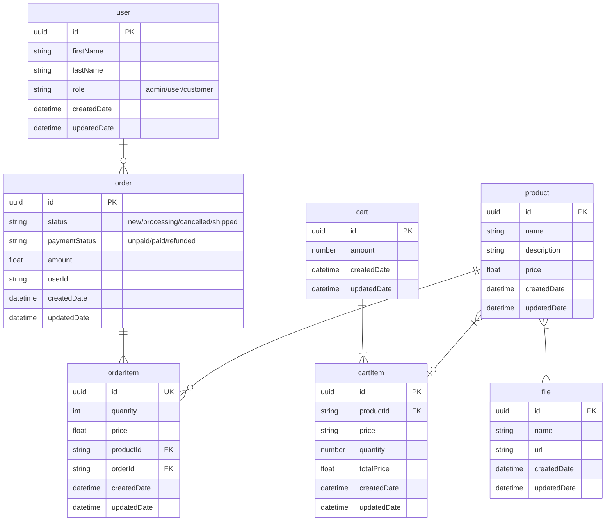

```mermaid
erDiagram
	direction TB
	user {
		uuid id PK ""
		string firstName  ""
		string lastName  ""
		string role  "admin/user/customer"
		datetime createdDate  ""
		datetime updatedDate  ""
	}

	cartItem {
		uuid id PK ""
		string productId FK ""
		string price  ""
		number quantity  ""
		float totalPrice  ""
		datetime createdDate  ""
		datetime updatedDate  ""
	}

	cart {
		uuid id PK ""
		number amount  ""
		datetime createdDate  ""
		datetime updatedDate  ""
	}

	product {
		uuid id PK ""
		string name  ""
		string description  ""
		float price  ""
		datetime createdDate  ""
		datetime updatedDate  ""
	}

	orderItem {
		uuid id UK ""
		int quantity  ""
		float price  ""
		string productId FK ""
		string orderId FK ""
		datetime createdDate  ""
		datetime updatedDate  ""
	}

	file {
		uuid id PK ""
		string name  ""
		string url  ""
		datetime createdDate  ""
		datetime updatedDate  ""
	}

	order {
		uuid id PK ""
		string status  "new/processing/cancelled/shipped"
		string paymentStatus  "unpaid/paid/refunded"
		float amount  ""
		string userId  ""
		datetime createdDate  ""
		datetime updatedDate  ""
	}

	user||--o{order:"  "
	order||--|{orderItem:"  "
	product||--o{orderItem:"  "
	cart||--|{cartItem:"  "
	product}|--o|cartItem:"  "
	product}|--|{file:"  "


```
