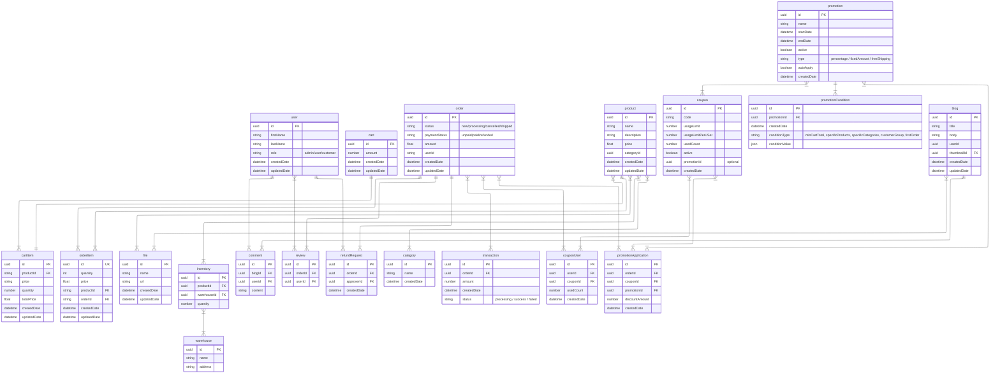

```mermaid
---
config:
  layout: elk
---
erDiagram
	direction TB
	user {
		uuid id PK ""
		string firstName  ""
		string lastName  ""
		string role  "admin/user/customer"
		datetime createdDate  ""
		datetime updatedDate  ""
	}
	cartItem {
		uuid id PK ""
		string productId FK ""
		string price  ""
		number quantity  ""
		float totalPrice  ""
		datetime createdDate  ""
		datetime updatedDate  ""
	}
	cart {
		uuid id PK ""
		number amount  ""
		datetime createdDate  ""
		datetime updatedDate  ""
	}
	orderItem {
		uuid id UK ""
		int quantity  ""
		float price  ""
		string productId FK ""
		string orderId FK ""
		datetime createdDate  ""
		datetime updatedDate  ""
	}
	file {
		uuid id PK ""
		string name  ""
		string url  ""
		datetime createdDate  ""
		datetime updatedDate  ""
	}
	order {
		uuid id PK ""
		string status  "new/processing/cancelled/shipped"
		string paymentStatus  "unpaid/paid/refunded"
		float amount  ""
		string userId  ""
		datetime createdDate  ""
		datetime updatedDate  ""
	}
	inventory {
		uuid id PK ""
		uuid productId FK ""
		uuid warehouseId FK ""
		number quantity  ""
	}
	comment {
		uuid id PK ""
		uuid blogId FK ""
		uuid userid FK ""
		string content  ""
	}
	review {
		uuid id PK ""
		uuid orderId FK ""
		uuid userId FK ""
	}
	warehouse {
		uuid id PK ""
		string name  ""
		string address  ""
	}
	refundRequest {
		uuid id PK ""
		uuid orderId FK ""
		uuid approverId FK ""
		datetime createdDate  ""
	}
	category {
		uuid id PK ""
		string name  ""
		datetime createdDate  ""
	}
	product {
		uuid id PK ""
		string name  ""
		string description  ""
		float price  ""
		uuid categoryId  ""
		datetime createdDate  ""
		datetime updatedDate  ""
	}
	transaction {
		uuid id PK ""
		uuid orderId FK ""
		number amount  ""
		datetime createdDate  ""
		string status  "processing / success / failed"
	}
	couponUser {
		uuid id PK ""
		uuid userId FK ""
		uuid couponId FK ""
		number usedCount  ""
		datetime createdDate  ""
	}
	coupon {
		uuid id PK ""
		string code  ""
		number usageLimit  ""
		number usageLimitPerUSer  ""
		number usedCount  ""
		boolean active  ""
		uuid promotionId  "optional"
		datetime createdDate  ""
	}
	promotionApplication {
		uuid id PK ""
		uuid orderId FK ""
		uuid couponId FK ""
		uuid promotionId FK ""
		number discountAmount  ""
		datetime createdDate  ""
	}
	promotionCondition {
		uuid id PK ""
		uuid promotionId FK ""
		datetime createdDate  ""
		string conditionType  "minCartTotal, specificProducts, specificCategories, customerGroup, firstOrder"
		json conditionValue  ""
	}
	promotion {
		uuid id PK ""
		string name  ""
		datetime startDate  ""
		datetime endDate  ""
		boolean active  ""
		string type  "percentage / fixedAmount / freeShipping"
		boolean autoApply  ""
		datetime createdDate  ""
	}
	blog {
		uuid id PK ""
		string title  ""
		string body  ""
		uuid userId  ""
		uuid thumbnailId FK ""
		datetime createdDate  ""
		datetime updatedDate  ""
	}

	order||--|{orderItem:"  "
	product||--|{orderItem:"  "
	cart||--|{cartItem:"  "
	product}|--||cartItem:"  "
	product}|--|{file:"  "
	promotion||--|{promotionCondition:"  "
	coupon}|--|{promotionApplication:"  "
	inventory}|--|{warehouse:"  "
	product}|--|{inventory:"  "
	order||--|{review:"  "
	blog||--|{comment:"  "
	user||--|{comment:"  "
	user}|--|{review:"  "
	order||--|{refundRequest:"  "
	order}|--|{transaction:"  "
	product}|--|{category:"  "
	user||--|{refundRequest:"  "
	promotion}|--|{coupon:"  "
	order}|--|{promotionApplication:"  "
	order}|--|{couponUser:"  "
	coupon}|--|{couponUser:"  "
	promotion}|--|{promotionApplication:"  "
	blog}|--|{file:"  "
```
