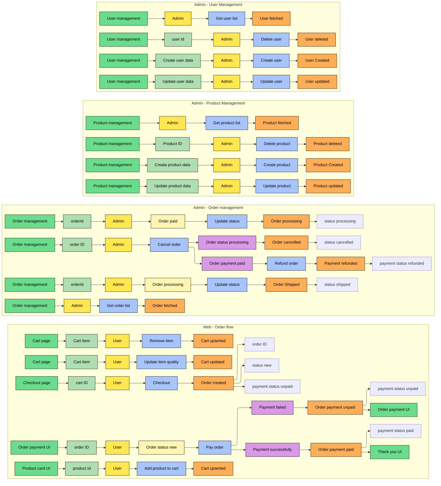

```mermaid
---
config:
  layout: elk
---
flowchart LR
 subgraph s3["Web - Order flow"]
        n16["Product card UI"]
        n17["User"]
        n18["Update item quality"]
        n19["Cart upserted"]
        n20["Checkout"]
        n61@{ label: "<span style=\"color:\">Add product to cart</span>" }
        n62["Cart upserted"]
        n70["Remove item"]
        n72@{ label: "<span style=\"color:\">Order created</span>" }
        n73["Cart page"]
        n74@{ label: "<span style=\"color:\">User</span>" }
        n75["product Id"]
        n76["Cart Item"]
        n77["Checkout page"]
        n78["cart ID"]
        n79["order ID"]
        n80["Order payment UI"]
        n81["Pay order"]
        n82["Payment successfully"]
        n83["Order payment paid"]
        n84["Payment failed"]
        n85["Order payment unpaid"]
        n97@{ label: "<span style=\"color:\">User</span>" }
        n112@{ label: "<span style=\"color:\">Cart Item</span>" }
        n113@{ label: "<span style=\"color:\">User</span>" }
        n114["Cart page"]
        n115@{ label: "<span style=\"color:\">Cart updated</span>" }
        n120["payment status unpaid"]
        n121["status new"]
        n128["payment status paid"]
        n129["payment status unpaid"]
        n131["User"]
        n132["Order status new"]
        n133["Order payment UI"]
        n134["Thank you UI"]
        n135["order ID"]
  end
 subgraph s5["Admin - Order management"]
        n63["Order management"]
        n64["Admin"]
        n65["Order paid"]
        n66@{ label: "<span style=\"background-color:\">Update status</span>" }
        n67["Order processing"]
        n68@{ label: "<span style=\"color:\">Get order list</span>" }
        n69["Order fetched"]
        n86["Order management"]
        n87["Admin"]
        n88["orderId"]
        n91["Order management"]
        n92@{ label: "<span style=\"color:\">orderId</span>" }
        n93["Admin"]
        n94@{ label: "<span style=\"color:\">Order processing</span>" }
        n95@{ label: "<span style=\"color:\">Update status</span>" }
        n96@{ label: "<span style=\"color:\">Order Shipped</span>" }
        n98["Order management"]
        n99["order ID"]
        n100["Admin"]
        n101["Cancel order"]
        n102@{ label: "<span style=\"color:\">Order payment paid</span>" }
        n104@{ label: "<span style=\"color:\">Order status processing</span>" }
        n105["Order cancelled"]
        n106["Payment refunded"]
        n123["payment status refunded"]
        n124["status cancelled"]
        n125["status shipped"]
        n127["status processing"]
        n130["Refund order"]
  end
 subgraph s1["Admin - Product Management"]
        RM1["Product management"]
        A1["Admin"]
        C1["Create product"]
        E3["Product Created"]
        n32["Update product"]
        n33["Product updated"]
        n34["Delete product"]
        n35["Product deleted"]
        n36["Get product list"]
        n37["Product fetched"]
        n39["Create product data"]
        n40["Product ID"]
        n41@{ label: "<span style=\"color:\">Admin</span>" }
        n42["Update product data"]
        n43["Admin"]
        n44["Admin"]
        n109["Product management"]
        n110["Product management"]
        n111["Product management"]
  end
 subgraph s4["Admin - User Management"]
        n45["User management"]
        n46["Admin"]
        n47["Create user"]
        n48["User Created"]
        n49["Update user"]
        n50["User updated"]
        n51["Delete user"]
        n52["User deleted"]
        n53["Get user list"]
        n54["User fetched"]
        n55["Create user data"]
        n56["user Id"]
        n57@{ label: "<span style=\"color:\">Admin</span>" }
        n58["Update user data"]
        n59["Admin"]
        n60["Admin"]
        n116["User management"]
        n118["User management"]
        n119["User management"]
  end
    RM1 --> n44
    A1 --> C1
    n16 --> n75
    n17 --> n61
    n18 --> n115
    n32 --> n33
    n34 --> n35
    n36 --> n37
    n39 --> A1
    n40 --> n41
    n41 --> n34
    n42 --> n43
    n43 --> n32
    n44 --> n36
    C1 --> E3
    n46 --> n47
    n49 --> n50
    n51 --> n52
    n53 --> n54
    n55 --> n46
    n56 --> n57
    n57 --> n51
    n58 --> n59
    n59 --> n49
    n60 --> n53
    n47 --> n48
    n61 --> n62
    n63 --> n64
    n64 --> n68
    n65 --> n66
    n66 --> n67
    n68 --> n69
    n70 --> n19
    n73 --> n76
    n74 --> n70
    n75 --> n17
    n76 --> n74
    n77 --> n78
    n78 --> n97
    n80 --> n135
    n81 --> n82 & n84
    n82 --> n83
    n84 --> n85
    n86 --> n88
    n87 --> n65
    n88 --> n87
    n91 --> n92
    n92 --> n93
    n93 --> n94
    n94 --> n95
    n95 --> n96
    n97 --> n20
    n98 --> n99
    n99 --> n100
    n100 --> n101
    n101 --> n102 & n104
    n102 --> n130
    n104 --> n105
    n109 --> n42
    n110 --> n39
    n111 --> n40
    n112 --> n113
    n113 --> n18
    n114 --> n112
    n116 --> n60
    n118 --> n58
    n119 --> n56
    n45 --> n55
    n72 --> n79 & n120 & n121
    n106 --> n123
    n105 --> n124
    n96 --> n125
    n67 --> n127
    n83 --> n128 & n134
    n85 --> n129 & n133
    n130 --> n106
    n131 --> n132
    n132 --> n81
    n135 --> n131
    n20 --> n72
    n19@{ shape: rect}
    n20@{ shape: rect}
    n61@{ shape: rect}
    n72@{ shape: rect}
    n74@{ shape: rect}
    n97@{ shape: rect}
    n112@{ shape: rect}
    n113@{ shape: rect}
    n115@{ shape: rect}
    n132@{ shape: rect}
    n63@{ shape: rect}
    n64@{ shape: rect}
    n65@{ shape: rect}
    n66@{ shape: rect}
    n67@{ shape: rect}
    n68@{ shape: rect}
    n69@{ shape: rect}
    n92@{ shape: rect}
    n94@{ shape: rect}
    n95@{ shape: rect}
    n96@{ shape: rect}
    n101@{ shape: rect}
    n102@{ shape: rect}
    n104@{ shape: rect}
    n123@{ shape: rect}
    n41@{ shape: rect}
    n45@{ shape: rect}
    n46@{ shape: rect}
    n47@{ shape: rect}
    n48@{ shape: rect}
    n49@{ shape: rect}
    n50@{ shape: rect}
    n51@{ shape: rect}
    n52@{ shape: rect}
    n53@{ shape: rect}
    n54@{ shape: rect}
    n55@{ shape: rect}
    n56@{ shape: rect}
    n57@{ shape: rect}
    n58@{ shape: rect}
    n59@{ shape: rect}
    n60@{ shape: rect}
     n16:::ui
     n17:::actor
     n18:::command
     n19:::event
     n20:::command
     n61:::command
     n62:::event
     n70:::command
     n72:::event
     n73:::ui
     n74:::actor
     n75:::read_models
     n76:::read_models
     n77:::ui
     n78:::read_models
     n80:::ui
     n81:::command
     n82:::policy
     n83:::event
     n84:::policy
     n85:::event
     n97:::actor
     n112:::read_models
     n113:::actor
     n114:::ui
     n115:::event
     n131:::actor
     n132:::reaction_policy
     n133:::ui
     n134:::ui
     n135:::read_models
     n63:::ui
     n64:::actor
     n65:::reaction_policy
     n66:::command
     n67:::event
     n68:::command
     n69:::event
     n86:::ui
     n87:::actor
     n88:::read_models
     n91:::ui
     n92:::read_models
     n93:::actor
     n94:::reaction_policy
     n95:::command
     n96:::event
     n98:::ui
     n99:::read_models
     n100:::actor
     n101:::command
     n102:::policy
     n104:::policy
     n105:::event
     n106:::event
     n130:::command
     RM1:::ui
     A1:::actor
     C1:::command
     E3:::event
     n32:::command
     n33:::event
     n34:::command
     n35:::event
     n36:::command
     n37:::event
     n39:::read_models
     n40:::read_models
     n41:::actor
     n42:::read_models
     n43:::actor
     n44:::actor
     n109:::ui
     n110:::ui
     n111:::ui
     n45:::ui
     n46:::actor
     n47:::command
     n48:::event
     n49:::command
     n50:::event
     n51:::command
     n52:::event
     n53:::command
     n54:::event
     n55:::read_models
     n56:::read_models
     n57:::actor
     n58:::read_models
     n59:::actor
     n60:::actor
     n116:::ui
     n118:::ui
     n119:::ui
    classDef external_system fill:#ffb3c5, stroke:#000, stroke-width:1px, color:#000
    classDef policy fill:#da99e6, stroke:#000, stroke-width:1px, color:#000
    classDef event fill:#feae57, stroke:#000, stroke-width:1px, color:#000
    classDef command fill:#a7c5fc, stroke:#000, stroke-width:1px, color:#000
    classDef actor fill:#fee750, stroke:#000, stroke-width:1px, color:#000, border-radius:0
    classDef reaction_policy fill:#fef5b2, stroke:#000, stroke-width:1px, color:#000
    classDef ui fill:#6adc8b, stroke:#000, stroke-width:1px, color:#000
    classDef read_models fill:#b0deb3, stroke:#000, stroke-width:1px, color:#000

```
