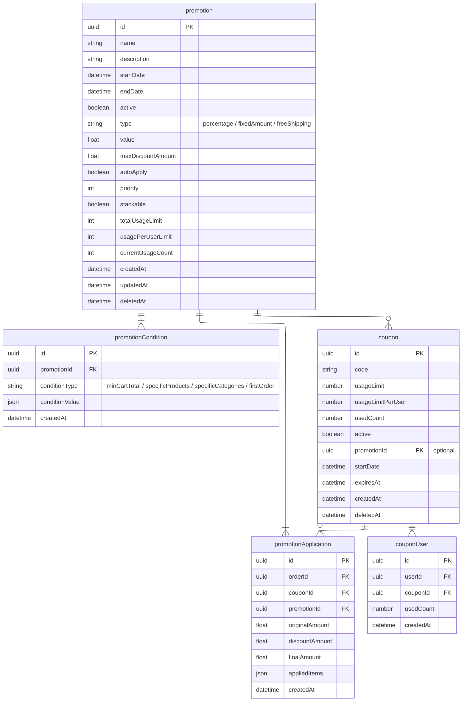

```mermaid
---
config:
  layout: elk
---
erDiagram
	direction TB

	%% Promotion System
	promotion {
		uuid id PK ""
		string name  ""
		string description  ""
		datetime startDate  ""
		datetime endDate  ""
		boolean active  ""
		string type  "percentage / fixedAmount / freeShipping"
		float value  ""
		float maxDiscountAmount  ""
		boolean autoApply  ""
		int priority  ""
		boolean stackable  ""
		int totalUsageLimit  ""
		int usagePerUserLimit  ""
		int currentUsageCount  ""
		datetime createdAt  ""
		datetime updatedAt  ""
		datetime deletedAt  ""
	}
	promotionCondition {
		uuid id PK ""
		uuid promotionId FK ""
		string conditionType  "minCartTotal / specificProducts / specificCategories / firstOrder"
		json conditionValue  ""
		datetime createdAt  ""
	}
	promotionApplication {
		uuid id PK ""
		uuid orderId FK ""
		uuid couponId FK ""
		uuid promotionId FK ""
		float originalAmount  ""
		float discountAmount  ""
		float finalAmount  ""
		json appliedItems  ""
		datetime createdAt  ""
	}

	%% Coupon System
	coupon {
		uuid id PK ""
		string code  ""
		number usageLimit  ""
		number usageLimitPerUser  ""
		number usedCount  ""
		boolean active  ""
		uuid promotionId FK "optional"
		datetime startDate  ""
		datetime expiresAt  ""
		datetime createdAt  ""
		datetime deletedAt  ""
	}
	couponUser {
		uuid id PK ""
		uuid userId FK ""
		uuid couponId FK ""
		number usedCount  ""
		datetime createdAt  ""
	}
	%% Relationships
	promotion||--|{promotionCondition:""
	promotion||--o{coupon:""
	promotion||--|{promotionApplication:""
	coupon||--|{couponUser:""
	coupon||--o{promotionApplication:""
```
